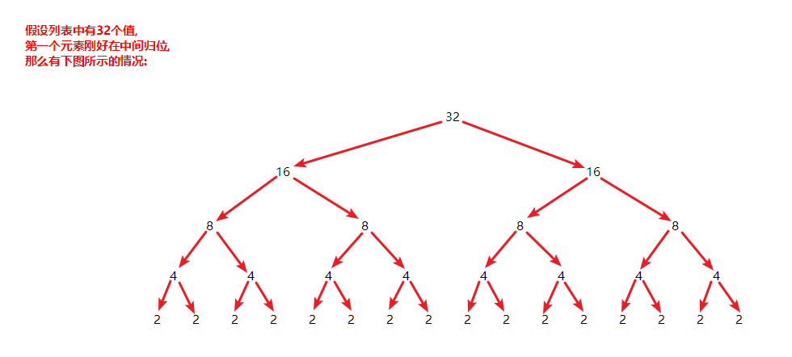
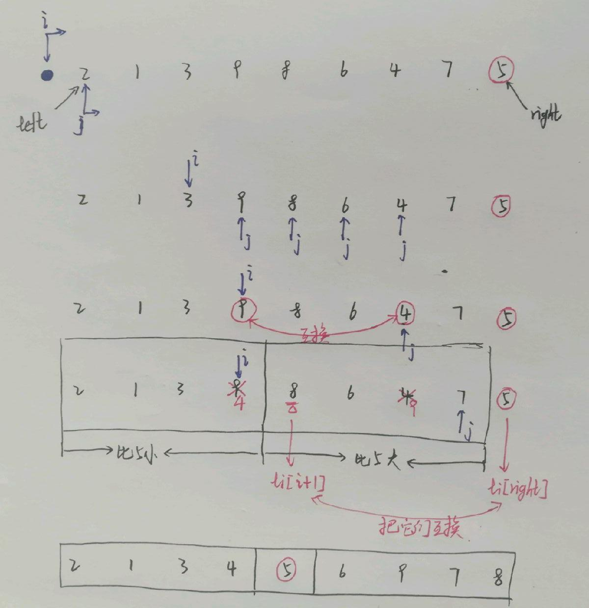
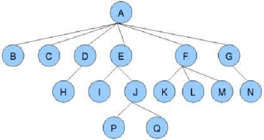
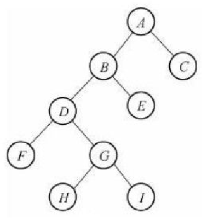
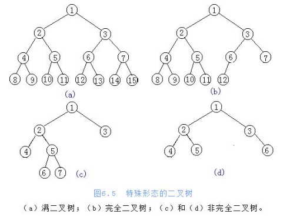
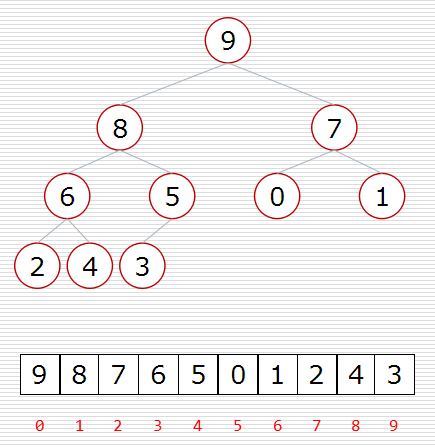
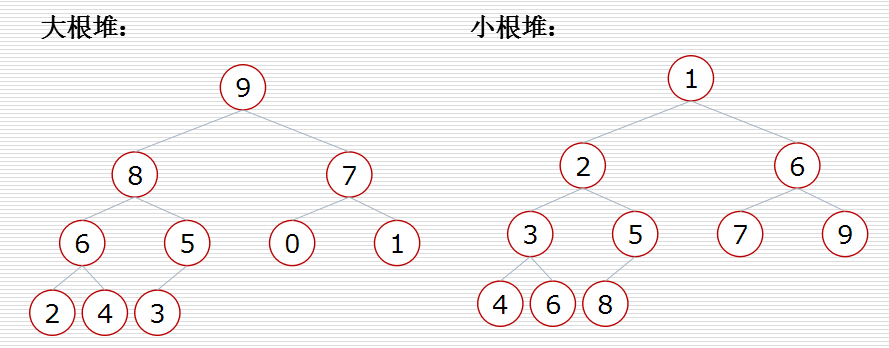
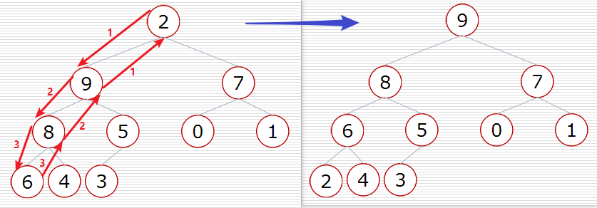

# 1 算法概念

- 时间复杂度

```
常见的时间复杂度:
O(1)<O(logn)<O(n)<O(nlogn)<O(n2)<O(n2logn)<O(n3)
```

- 空间复杂度

- 什么是算法: 一个计算过程, 解决问题的方法

# 2 递归

## 2.1 递归的两个特点

- 调用自身
- 结束条件

```python
# 递归

def func1(x):
    if x > 0:
        print(x, end=' ')
        func1(x - 1)


def func2(x):
    if x > 0:
        func2(x - 1)
        print(x, end=' ')


func1(3)
print('/')
func2(3)
print('/')


# result:
# 3 2 1 /
# 1 2 3 /
```

## 2.2 汉诺塔问题

假设有3根柱子,分别为A, B, C.

**问:** 把n个圆盘从A经过B移动到C, 每次只能移动一个圆盘, 移动的顺序是什么? 总共要移动多少次?

**分析:** 把一个复杂问题分解为简单的子问题, 类似于数学归纳法, 找规律.

- 最底下的: 第n个圆盘
- 其余: n-1个圆盘
- 步骤:
  - 把n-1个圆盘从A移动到B: A->B
  - 把第n个圆盘从A移动到C: A->C
  - 把n-1个圆盘从B移动到C: B->C

- 输入: 圆盘的个数, 三根柱子
- 输出: 移动的顺序, 移动的次数

```python
def hanoi(n, A, B, C):
    if n > 0:
        hanoi(n-1, A, C, B)	# 把n-1个圆盘从A移动到B: A->B
        hanoi(1, A, B, C)	# 把第n个圆盘从A移动到C: A->C
        hanoi(n-1, B, A, C)	# 把n-1个圆盘从B移动到C: B->C
```

```python
def hanoi1(n, A, B, C):
    if n > 0:
        hanoi1(n-1, A, C, B)
        print(f'{A}->{C}', end=',')
        hanoi1(n-1, B, A, C)
```

```python
def hanoi2(n, A, B, C):
    count = 0
    if n == 1:
    	print(f'{A}->{C}', end=',')
        return 1
    elif n > 1:
        count += hanoi2(n-1, A, C, B)
        count += hanoi2(1, A, B, C)
        count += hanoi2(n-1, B, A, C)
    return count


res = hanoi2(3, 'A', 'B', 'C')
print(res)

# result:
# A->C, A->B, C->B, A->C, B->A, B->C, A->C, 7
```

## 2.3 面试题: 台阶问题(铺砖问题)

一段有n个台阶组成的楼梯, 小明从楼梯的最底层向最高处前进, 它可以选择一次迈一级台阶或者一次迈两级台阶. 问: 它有多少种不同的走法?

- 分析:

```python
假设n个台阶的楼梯一共有 f(n) 种走法.
在这里,我们只讨论 第一次迈的台阶数的改变 会出现的问题:
    第一次迈1级台阶: 还剩下 f(n-1) 种走法
    第一次迈2级台阶: 还剩下 f(n-2) 种走法
而总共只有以上两种情况,所以有: f(n)=f(n-1)+f(n-2)
不难发现:
    f(1)=1
    f(2)=2
```

- 算法:

```python
def f(n):
    if n < 1:
        return
    elif n == 1:
        return 1
    elif n == 2:
        return 2
    else:
        return f(n-1) + f(n-2)
```

事实上, 我们发现, 该题的原理类似于**斐波那契数列**.

## 2.4 斐波那契数列

- 什么是斐波那契数列?

```python
# 斐波那契数列:
[1, 1, 2, 3, 5, 8, ...]

# 通项公式:
f(0) = 1
f(1) = 1
f(n) = f(n-1)+f(n-2)
```

- 写一个算法, 返回斐波那契数列的第n个数?

```python
# 方法一

def fib(n):
    if n == 0 or n == 1:
        return 1
    else:
        return fib(n-1) + fib(n-2)

    
'''
时间复杂度: 2^n
原因: 有重复计算(树结构,左右两边有重复计算)
'''
```

```python
# 方法二

def fib2(n):
    if n == 0 or n == 1:
        return 1
    else:
        li = [1, 1]
        # 第n个数就要算到第n次,这里要取到n,所以是n+1
        for i in range(2, n+1)
        	# 以空间换时间
        	li.append(li[-1]+li[-2])
        return li[-1]

    
'''
时间复杂度: O(n)
空间复杂度: O(n)
求第n个数就要计算n次开辟n个空间,时间复杂度降低了,但空间复杂度增加了.典型的以时间换取空间.
'''
```

```python
# 方法三(了解)

def fib3(n):
    # 该列表用于记录计算出来的所有值
    # 由于索引要取到n,所有是n+1
    li = [-1 for i in range(n+1)]
    def f(n):
        if n == 0 or n == 1:
            return 1
        elif li[n] >= 0:
            return li[n]
        else:
            v = f(n-1) + f(n-2)
            li[n] = v
        	return li[n]
    return f(n)


'''
该方法把每次计算出来的值都记录在列表中了,下一次计算只需要去列表中取就可以了,去掉了重复计算,因此效率有所提高.但该方法仍然开辟了新空间.时间和空间复杂度与方法二是一样的.
'''
```

```python
# 方法四(推荐)

def fib(n):
    if n == 0 or n == 1:
        return 1
    else:
        a = 1
        b = 1
        for i in range(2, n+1):
            c = a + b
            a = b
            b = c
        return b
    
'''
时间复杂度: O(n)
空间复杂度: O(1)
'''
```

# 3 列表查找

- 列表查找: 从列表中查找指定元素
  - 输入: 列表, 待查找元素
  - 输出: 元素下标或未查找到元素

- 顺序查找:
  - 从列表第一个元素开始, 顺序进行搜索, 直到找到为止
- 二分查找:
  - 从有序列表的候选区`data[0:n]`开始, 通过对待查找的值与候选区中间值的比较, 可以使候选区减少一半

## 3.1 二分查找

- 分析:

```python
输入: 有序列表, 元素值
输出: 若找到,返回元素值的位置(索引);若没找到,返回-1
    
思想: 定义三个指针,分别为 low, mid, high
    候选区: [low, high]
    当候选区存在,即low<=high: mid=(low+high)//2
        若 val>li[mid], 则 low=mid+1
        若 val<li[mid], 则 high=mid-1
        若 val=li[mid], 则 返回mid
    当候选区不存在:
        返回 -1
```

- 算法:

```python
def binary_search(li, val):
    low = 0
    high = len(li)
    while low <= high:	# li中至少有一个值
        mid = (low + high) // 2
        if val > li[mid]:
            low = mid + 1
        elif val < li[mid]:
            high = mid - 1
        else:
            return mid
    return -1
```

# 4 列表排序

- 列表排序
  - 将无序列表变为有序列表
- 应用场景
  - 各种榜单
  - 各种表格
  - 给二分查找用
  - 给其他算法用
- 输入: 无序列表
- 输出: 有序列表
- 排序lowB三人组
  - <font color='red'>冒泡排序</font>
  - <font color='red'>选择排序</font>
  - <font color='red'>插入排序</font>
- 排序NB三人组
  - <font color='red'>快速排序</font>
  - <font color='orange'>堆排序</font>
  - <font color='red'>归并排序</font>
- 不常用的排序
  - 基数排序
  - 希尔排序
  - 桶排序

## 4.1 冒泡排序

- 思想

```python
比较列表中相邻两个数,若左>右,交换它们
假设我们先把最大的数排到最右侧,那么右边就是有序区,左边就是无序区

循环第0趟  无序区的范围:[0, n)  有序区:0个  无序区:n个
循环第1趟  无序区的范围:[0, n-1)  有序区:1个  无序区:n-1个
	...
循环第i趟  无序区的范围:[0, n-i)  有序区:i个  无序区:n-i个

注意:
    一共循环n-1趟列表就已经有序,最后一趟不必循环
    优化: 如果循环一次,没有发生任何交换,说明已经有序,不必再循环

关键点: 趟, 无序区
```

- 算法:

```python
def bubble_sort(li):
    for i in range(len(li)-1):	# 第i趟
        for j in range(0, len(li)-i-1)	# 无序区范围,减1是因为j+1
        	if li[j] > li[j+1]:
                li[j], li[j+1] = li[j+1], li[j]
    return li
```

```python
# 优化

def bubble_sort(li):
    for i in range(len(li)-1):	# 第i趟
        exchange = False
        for j in range(0, len(li)-i-1)	# 无序区范围
        	if li[j] > li[j+1]:
                li[j], li[j+1] = li[j+1], li[j]
                exchange = True
        if not exchange:	# 没有交换
            return li
    return li
```

## 4.2 选择排序

- 思想:

```python
设列表长度为n,最开始整个列表都是无序区.选择排序指:遍历n趟,每趟遍历都从无序区中选出最小值与无序区第一个值交换.

步骤:
    1.找出无序区
    	第0趟  无序区[0, n)
        第1趟  无序区[1, n)
        ...
        第i趟  无序区[i, n)
    2.找出无序区最小值的位置
    	把第0个数作为最小值(以第0个数为基准),从第一个数开始遍历列表,如果有一个数比此时的最小值更小,更新此时的最小值
    3.交换数值
```

- 算法:

```python
# 如何找出一个无序列表的最小值(位置)?

# 找最小值
def find_min(li):
    min_num = li[0]	# 以第0个数为基准
    for i in range(1, len(li)):	# 从第1个数开始遍历
        if li[i] < min_num:	# 如果有一个数比此时的min_num更小
            min_num = li[i]	# 更新min_num
    return min_num


# 找最小值位置(索引)
def find_min_pos(li):
    min_pos = 0	# 以索引0为基准
    for i in range(1, len(li)):
        if li[i] < li[min_pos]:	# 如果索引i对应的数比min_pos对应的数更小
            min_pos = i	# 更新min_pos
    return min_pos
```

```python
# 选择排序
def select_sort(li):
    for i in range(0, len(li)):
        min_pos = i
        for j in range(i, len(li)):
            if li[j] < li[min_pos]:
                min_pos = j
       	li[i], li[min_pos] = li[min_pos], li[i]
    return li
```

## 4.3 插入排序

- 思想:

```python
与扑克牌游戏类似,一开始有序区有1个值,无序区有n-1个值.插入排序指:每一趟从无序区中选出一个值插入到有序区中,直到无序区变为空为止.

难点: 如何保证插入后,有序区始终有序.
    
分析:
            3  5  4  8  2  1  6  9  7
    第1趟:  有序区: 3  无序区: 5  4  8  2  1  6  9  7
    第2趟:  有序区: 3  5  无序区: 4  8  2  1  6  9  7
    第3趟:  有序区: 3  4  5  无序区: 8  2  1  6  9  7
    第4趟:  有序区: 3  4  5  8  无序区: 2  1  6  9  7
    第5趟:  有序区: 2  3  4  5  8  无序区: 1  6  9  7
```

- 算法:

```python
def insert_sort(li):
    for i in range(1, len(li)):	# 第i趟
        tmp = li[i]	# 选出来的牌(每走一趟tmp就记录一次)
        j = i - 1	# 初始的j是有序区最后一个位置,li[j]在tmp左侧
        while j >= 0 and li[j] > tmp:
            li[j], li[j+1] = li[j], li[j+1]
            j -= 1
    return li
```

## 4.4 快速排序

```python
思想:
    1. 取一个元素p(列表的第一个元素),使元素p归位
    	归位: 列表被p分成两部分,左边都比p小,右边都比p大
    2. 递归完成排序
    	递归 排p的左边
        递归 排p的右边

难点: 如何使元素p归位?
```

- 算法:

```python
# 方法一

def quick_sort(li, left, right):
    if left < right:	# 保证至少两个元素
        mid = partition(li, left, right)	# 归位
        quick_sort(li, left, mid-1)		# 排左边
        quick_sort(li, mid+1, right)	# 排右边

def partition(li, left, right):
    tmp = li[left]	# 记录列表第一个元素
    while left < right:
        while left < right and li[right] >= tmp:
            right -= 1
        li[left] = li[right]
        while left < right and li[left] <= tmp:
            left += 1
        li[right] = li[left]
    li[left] = tmp	# 此时left=right
    return left
```

```python
不难看出,quick_sort的递归次数是logn, 而每一次递归执行partition的时间复杂度是O(n),所以快速排序的时间复杂度是O(nlogn)

但是,偶尔会出现这样的情况,列表中的所有数字以升/降序排列,这就是快速排序的最坏情况了,此时时间复杂度变成了O(n2)

如何解决快速排序的最坏情况: 每次递归时都随机从列表中选取一个值作为那个需要归位的元素
```



```python
# 方法一优化: 增加随机性(治标不治本),把最坏情况发生的概率平摊到整个排序的过程中,而不是某一次递归的过程中.
import random

def quick_sort(li, left, right):
    if left < right:	# 保证至少两个元素
        mid = partition(li, left, right)	# 归位
        quick_sort(li, left, mid-1)		# 排左边
        quick_sort(li, mid+1, right)	# 排右边

def partition(li, left, right):
    i = random.randint(left, right)
    li[left], li[i] = li[i], li[left]
    tmp = li[left]	# 记录列表第一个元素
    while left < right:
        while left < right and li[right] >= tmp:
            right -= 1
        li[left] = li[right]
        while left < right and li[left] <= tmp:
            left += 1
        li[right] = li[left]
    li[left] = tmp	# 此时left=right
    return left
```

```python
# 第二种归位的方法:
    
以列表最右侧的值作为需要归位的元素
我们现在来维护两个区域: 左区域都比li[right]小,右区域都比li[right]大
给一个列表定义上下两个指针分别为i和j
j指针会遍历到列表中每一个元素(最后一个除外)
当且仅当j指针指向的元素小于最后一个元素时,i指针才会向前移动一个位置,此时再将i,j对应的值交换一次
循环结束,可以发现i+1是右区域第一个位置
互换li[i+1]和li[right],归位结束
```



```python
# 第二种归位方法

def quick_sort(li, left, right):
    if left < right:	# 保证至少两个元素
        mid = partition(li, left, right)	# 归位
        quick_sort(li, left, mid-1)		# 排左边
        quick_sort(li, mid+1, right)	# 排右边

def partition(li, left, right):
    i = left -1
    for j in range(left, right):
        if li[j] < li[right]:
            i += 1
            li[i], li[j] = li[j], li[i]
    li[i+1], li[right] = li[right], li[i+1]
    return i+1
```

```python
# 方法二(不推荐)
# 缺点: 重新开辟了新的空间

def quick_sort(li):
    if len(li) < 2:
    	return li
    x = li[0]
    left = [li[i] for i in range(1, len(li)) if li[i] < x]
    right = [li[i] for i in range(1, len(li)) if li[i] > x]
    quick_sort(left)
    quick_sort(right)
    return left + [x] + right
```

## 4.5 堆排序(了解)

### 4.5.1 树与二叉树简介

- 树是一种数据结构
- 树是一种可以递归定义的数据结构
- 树是由n个节点组成的集合
  - 如果n=0, 那这是一颗空树
  - 如果n>0, 那存在1个节点作为树的根节点, 其他节点可以分为m个集合, 每个集合本身又是一棵树

**一些概念:**

- 根节点: 只有子节点没有父节点
- 叶子节点: 只有父节点没有子节点
- 树的深度(高度): 组成该树各结点的最大层次
- 树的度: 结点所拥有的子树的个数称为该结点的度; 树中各结点<font color='red'>度的最大值</font>称为该树的度



- 二叉树: 度最大为2的树



- 特殊二叉树
  - 满二叉树: 一个二叉树, 如果每一层的节点数都达到最大值, 则这个二叉树就是满二叉树
  - 完全二叉树: 叶子节点只能出现在最下层和次下层, 并且最下面一层的节点都集中在该层最左边的若干位置的二叉树



二叉树的存储方式:

- 链式存储方式
- 顺序存储方式(列表)

父节点和左孩子节点的编号下标之间的关系: `i --> 2i+1`

父节点和右孩子节点的编号下标之间的关系: `i --> 2i+2`



总结:

```
树 --> 二叉树 --> 完全二叉树

二叉树是度不超过2的树
特殊二叉树: 满二叉树,完全二叉树
	(完全)二叉树可以用列表来存储,通过规律可以从父亲找到孩子或从孩子找到父亲
```

### 4.5.2 堆

大根堆: 一颗完全二叉树, 满足任一节点都比其孩子节点大

小根堆: 一颗完全二叉树, 满足任一节点都比其孩子节点小



堆的向下调整性质:

- 假设: 节点的左右子树都是堆, 但自身不是堆
- 当根节点的左右子树都是堆时, 可以通过一次向下的调整来将其变换成一个堆



堆排序过程:

```python
1. 建立堆
2. 得到堆顶元素, 为最大元素
3. 去掉堆顶, 将堆最后一个元素放到堆顶, 此时可通过一次调整重新使堆有序
4. 堆顶元素为第二大元素
5. 重复步骤3, 直到堆变为空
```

### 4.5.3 堆排序算法

```python
def sift(li, low, high):
    # low表示堆顶 下标,high表示堆中最后一个元素下标
    tmp = li[low]
    i = low	# 堆顶下标
    j = 2 * i + 1	# 左子节点下标
    while j <= high:	# 第二种循环退出情况,没有孩子和tmp竞争i这个位置
        if j+1 <= high and li[j+1] > li[j]:
            j += 1
        if li[j] > tmp:
            li[i] = li[j]
            i = j
            j = 2 * i + 1
        else:
            break	# 第一种循环退出情况,tmp比目前两个孩子都大
    li[i] = tmp
    
    
def heap_sort(li):
    # 1. 从列表构造堆 low的值和high的值
    n = len(li)
    for low in range(n//2-1, -1, -1):
        sift(li, low, n-1)
    # 2. 挨个出数,利用原来的空间存储下来的值,但是这些值不属于堆
    for high in range(n-1, -1, -1):
        li[high], li[0] = li[0], li[high]
        sift(li, 0, high-1)
    return li
```

## 4.6 归并排序

- 原理?待续

- 分析?待续

- 算法:

```python
def merge(li, low, mid, high):
    i = low
    j = mid + 1
    li_tmp = []
    while i <= mid and j <= high: # 两边都有数
        if li[i] <= li[j]:
            li_tmp.append(li[i])
            i += 1
        else:
            li_tmp.append(li[j])
            j += 1
    # i<=mid 和 j<=high 两个条件 只能有一个满足
    while i <= mid:
        li_tmp.append(li[i])
        i += 1
    while j <= high:
        li_tmp.append(li[j])
        j += 1
    # li_tmp 0~high-low 复制回li low~high
    for i in range(len(li_tmp)):
        li[low+i] = li_tmp[i]


def _merge_sort(li, low, high):
    if low < high: # 至少两个元素
        # print(li[low:high+1], '->', end=' ')
        mid = (low + high) // 2  # 分解
        # print(li[low:mid+1], li[mid+1: high+1])
        _merge_sort(li, low, mid) # 递归排序左边
        _merge_sort(li, mid+1, high) # 递归排序右边
        # print(li[low:mid+1], li[mid+1: high+1], '->', end=' ')
        merge(li, low, mid, high) # 一次归并 合并
        # print(li[low:high+1])
```

